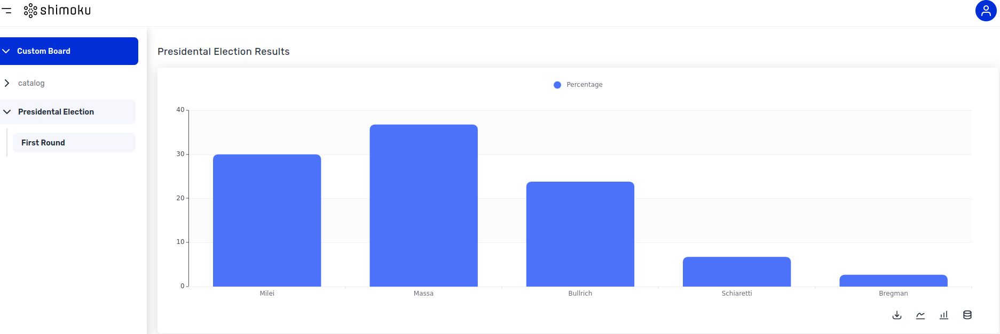

# Trying Shimoku Data App

## Setup

Installing the libraries from `requirements.txt`.

``` shell
pip install -r requirements.txt
```

Create a `.env` file similar to `.env.sample` and set the environment variables.


## Generate Dashboard

To generate the dashboard, use the following command:


```shell
make generate-dashboard
```


